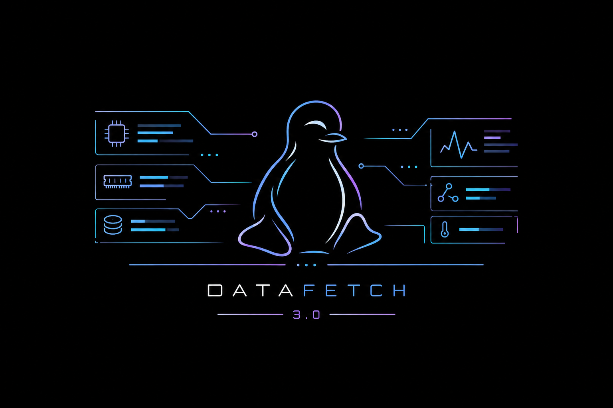
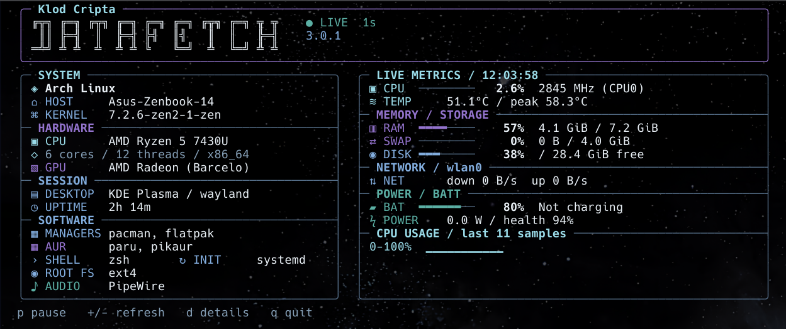
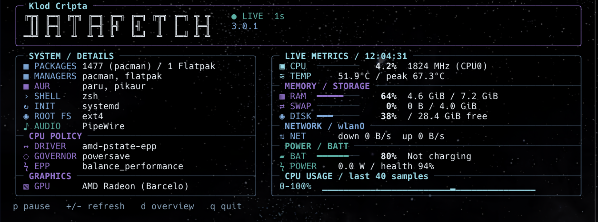
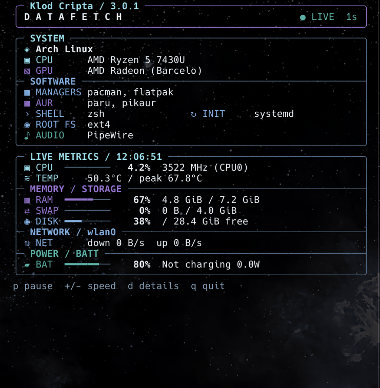
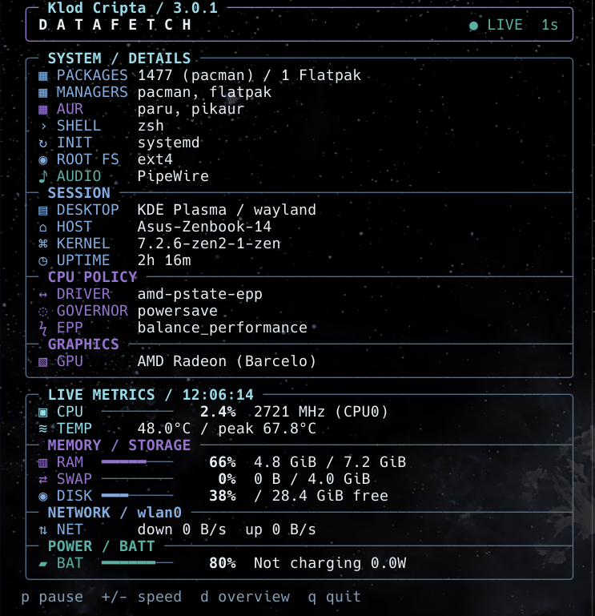

# Datafetch 3.0.1

[English](#english) · [Italiano](#italiano)


[](LICENSE)

## English

<p align="center">
  
</p>

**Datafetch** is a Bash dashboard for GNU/Linux that brings system information and live readings into the same terminal window. Hardware and software details sit alongside CPU, memory, disk, network and battery readings.

Its **Nordic-inspired palette** combines icy white, light blue, cyan, pine green and cold violet. An outlined DATAFETCH title, fine borders, section dividers and small colored icons give each group its own space.

### What it does

- Shows the computer's hardware, desktop session and software environment.
- Updates live readings at a selectable interval, with keyboard controls for pause and details.
- Adapts the panels to the terminal size, placing them side by side or stacking them vertically.
- Prints a plain-text snapshot when requested or when output is piped or redirected.

Datafetch reads local information without making network requests or changing system settings. Run it as your normal user: no installation or root access is required. The dashboard's labels are in English; this README is available in English and Italian.

### What's new in 3.0.1

- **Redesigned interface:** the new Nordic-inspired palette, outlined title, Klod Cripta signature, framed panels, internal dividers and field icons.
- **Updates designed to reduce flicker:** only changed rows are redrawn, together in one output operation, without clearing the whole screen at each refresh.
- **Adaptive layout and details pages:** information remains accessible in terminals as small as 48 columns × 16 rows.
- **More software information:** package managers, multiple AUR helpers, the launching shell, init system, root filesystem and running audio servers. Desktop names include **KDE Plasma**, GNOME, LXQt, Cinnamon and others.
- **Reworked hardware detection:** GPU names use device identifiers and local databases, with support for multiple GPUs; CPU temperature readings use CPU sensors when available.
- **More controls and output modes:** pause, adjustable refresh, a CPU usage chart, snapshot output, ASCII mode and optional icons and colors.

See the [changelog](CHANGELOG.md) for the release notes.

### Fields and details

> **Press D to open additional details.** Press D again to move through any further pages, then return to the overview. Both `d` and `D` work. Live readings remain visible while you browse.

| Field or section | What it shows |
| --- | --- |
| SYSTEM | Distribution, hostname and kernel. |
| HARDWARE | CPU model, physical cores, threads, architecture and GPU. |
| SESSION | Desktop or session name, Wayland/X11 when detected, and system uptime. |
| MANAGERS | Detected native package manager and available Flatpak, Snap, Nix or Guix commands. |
| AUR | Supported AUR helpers found on pacman systems, separated by commas. |
| SHELL / INIT | Launching shell and init system, such as systemd or OpenRC. |
| ROOT FS / AUDIO | Filesystem mounted at `/` and the current user's running audio servers. |
| CPU / TEMP | CPU usage, frequency reported for CPU0, temperature and the highest temperature seen during this Datafetch session. |
| RAM / SWAP | Memory usage and totals; swap is marked as disabled when absent. |
| DISK | Used space and free space on `/`, refreshed every five seconds. |
| NET | Receive and transmit rates on the default or selected network interface. |
| BAT / POWER | First detected system battery: charge, charging state, power and health, where available. |
| CPU USAGE | Recent CPU usage on a 0–100% scale, shown when there is room. Up to 40 samples; the time covered depends on the refresh interval. |

The **SOFTWARE** block appears in the overview when space permits. **D** also opens package counts, complete software lists, CPU frequency driver, governor, energy performance preference (EPP) and the list of detected GPUs. On small terminals, these details are split across numbered pages. Overview values ending in `~` have been shortened to fit.

Supported native package tools include pacman, apt/dpkg, Portage, dnf/dnf5, zypper, yum/rpm, xbps and apk. Supported AUR helpers are **paru, yay, pikaur, aura, trizen and pakku**. Multiple matches appear as, for example, `paru, pikaur`; when none is found, the field reads `non pervenuto` (“not found”). Audio detection covers running **PipeWire, PulseAudio and JACK** processes.

GPU detection uses PCI/sysfs information, optional `lspci` output and local device databases. A codename such as **Barcelo** is kept when a more precise model cannot be established; the GPU is not guessed from the CPU model. Missing information is generally shown as `n/a`. Available readings depend on hardware, drivers and installed tools.

### Keyboard controls

| Key | Action |
| --- | --- |
| **D** | **Open details, advance through pages, then return to the overview.** |
| **P** or Space | Pause or resume live readings. |
| **+ / −** | Faster or slower refresh: 0.5, 1, 2, 5 or 10 seconds. |
| **Q**, Ctrl+C or Ctrl+D | Exit and restore the terminal. |

Letter keys also work in lowercase. The default refresh interval is one second.

### Screenshots

**Overview — system information, software and live readings.**

<p align="center">
  <a href="screenshots/datafetch3_1.png"></a>
</p>

**Details opened with D — packages, CPU policy and graphics, alongside live readings.**

<p align="center">
  <a href="screenshots/datafetch3_2.png"></a>
</p>

**Compact layout — overview on the left, details on the right.**

<p align="center">
  <a href="screenshots/datafetch3_4.png"></a>
  <a href="screenshots/datafetch3_3.png"></a>
</p>

Click a screenshot to view the full image. These examples show one computer; detected fields and available readings vary by system. The background comes from the terminal's transparency and desktop wallpaper, not from Datafetch.

### Requirements

- **GNU/Linux and Bash 4.3 or later**, with `/proc` and `/sys` available.
- Standard utilities: `awk`, `df`, `stty`, `uname`, `ps`, `sleep`, `wc`, `locale` and `readlink`.
- A terminal of at least **48 × 16** characters for live mode; **80 × 24 or larger** is more comfortable. Panels appear side by side from 104 columns and 20 rows when compact mode is off.

`lscpu`, `lspci`, `pgrep` and package-management tools are optional and enrich the detected information. Local `pci.ids` and `amdgpu.ids` databases improve GPU naming when available.

A UTF-8 locale enables the decorative symbols and rounded borders. True color, 256-color and basic ANSI terminals are supported. **No Nerd Font, graphical desktop or Python installation is needed to run Datafetch.** Use `--ascii` or `--no-icons` if your terminal font does not display the symbols well. Basic ANSI colors follow the terminal's palette.

### Download and run

Clone the repository and run the script:

```bash
git clone https://github.com/KlodCripta/Datafetch.git
cd Datafetch
chmod +x datafetch.sh
./datafetch.sh
```

Alternatively, [download `datafetch.sh`](https://raw.githubusercontent.com/KlodCripta/Datafetch/main/datafetch.sh), save it and run it from its directory:

```bash
bash datafetch.sh
```

Git is needed only for the clone method. Start Datafetch without `sudo` so session-specific information belongs to your own user.

Useful options:

| Option | Purpose |
| --- | --- |
| `--details` | Start directly in the details view. |
| `--interval 2` | Refresh every two seconds; accepts values from 0.5 to 10. |
| `--compact` | Use the compact layout. |
| `--interface wlan0` | Monitor a specific interface; replace `wlan0` with its name. |
| `--once` | Print a snapshot and exit. |
| `--once --width 120` | Print a wider snapshot; width accepts 48–160 columns. |
| `--no-icons` | Hide the icons while retaining the frame style. |
| `--ascii --no-color` | Use plain ASCII without colors. |
| `--help` / `--version` | Show all options or the version. |

To save a snapshot, redirect the output; Datafetch selects snapshot mode automatically:

```bash
bash datafetch.sh > system.txt
```

Colors also respect `NO_COLOR`; `--color always` and `--color never` override automatic selection.

### Tests

Tests are optional for users and require **Python 3** in addition to Bash. Run them from the cloned repository:

```bash
bash -n datafetch.sh
python3 -m unittest discover -s tests -v
```

The 3.0.1 suite contains **45 automated tests** covering hardware and software detection, sensor calculations, layout sizes, details pagination and terminal behavior during refresh, pause, resizing, suspend/resume and exit. Hardware fixtures and pseudo-terminals allow these checks without requiring every device.

These checks do not replace testing on real hardware. Display behavior and flicker on very old netbooks still need confirmation on those machines.

### Author and license

Written by **Klod Cripta**. Released under the [MIT License](LICENSE).

For bugs or suggestions, [open an issue](https://github.com/KlodCripta/Datafetch/issues) or write to [KlodCripta@linux.it](mailto:KlodCripta@linux.it).

---

## Italiano

<p align="center">
  
</p>

**Datafetch** è una dashboard Bash per GNU/Linux che riunisce informazioni di sistema e letture in tempo reale nella stessa finestra del terminale. I dettagli di hardware e software affiancano le letture di CPU, memoria, disco, rete e batteria.

La **palette ispirata allo stile Nordic** combina bianco freddo, blu chiaro, azzurro, verde pino e viola freddo. Il titolo DATAFETCH a contorno, le cornici sottili, i divisori e le piccole icone colorate danno a ogni gruppo il proprio spazio.

### Che cosa fa

- Mostra hardware, sessione desktop e ambiente software del computer.
- Aggiorna le letture dal vivo a un intervallo selezionabile, con comandi da tastiera per pausa e dettagli.
- Adatta i riquadri alla dimensione del terminale, affiancandoli oppure disponendoli in verticale.
- Stampa un'istantanea testuale su richiesta o quando l'output viene reindirizzato o passato a un altro comando.

Datafetch legge informazioni locali senza effettuare richieste di rete o modificare le impostazioni del sistema. Si avvia come utente normale: non servono installazione o permessi di amministratore. Le etichette della dashboard sono in inglese; questo README è disponibile in inglese e in italiano.

### Novità della versione 3.0.1

- **Interfaccia ridisegnata:** nuova palette ispirata allo stile Nordic, titolo a contorno, firma Klod Cripta, riquadri, divisori interni e icone per le voci.
- **Aggiornamento pensato per ridurre lo sfarfallio:** vengono ridisegnate solo le righe cambiate, insieme in un'unica operazione di scrittura, senza cancellare tutta la schermata a ogni ciclo.
- **Layout adattivo e pagine di dettaglio:** le informazioni restano accessibili anche in terminali di 48 colonne × 16 righe.
- **Più informazioni sul software:** gestori dei pacchetti, più AUR helper, shell di avvio, sistema init, filesystem della radice e server audio in esecuzione. I nomi dei desktop comprendono **KDE Plasma**, GNOME, LXQt, Cinnamon e altri.
- **Rilevamento hardware rivisto:** i nomi delle GPU usano gli identificativi dei dispositivi e i database locali, con supporto per più schede; le temperature della CPU provengono dai suoi sensori, quando disponibili.
- **Più controlli e modalità di output:** pausa, frequenza di aggiornamento regolabile, grafico dell'utilizzo CPU, istantanea testuale, modalità ASCII e possibilità di disattivare icone e colori.

Le note della versione sono raccolte nel [changelog](CHANGELOG.md).

### Voci e dettagli

> **Premi D per aprire gli altri dettagli.** Premi ancora D per scorrere le eventuali pagine successive e tornare alla schermata principale. Funzionano sia `d` sia `D`. Le letture dal vivo restano visibili durante la consultazione.

| Voce o sezione | Che cosa mostra |
| --- | --- |
| SYSTEM | Distribuzione, nome del computer e kernel. |
| HARDWARE | Modello della CPU, core fisici, thread, architettura e GPU. |
| SESSION | Nome del desktop o della sessione, Wayland/X11 quando rilevato e tempo trascorso dall'avvio del sistema. |
| MANAGERS | Gestore dei pacchetti nativo rilevato e comandi Flatpak, Snap, Nix o Guix disponibili. |
| AUR | AUR helper supportati trovati sui sistemi con pacman, separati da virgole. |
| SHELL / INIT | Shell da cui è stato avviato il programma e sistema init, come systemd o OpenRC. |
| ROOT FS / AUDIO | Filesystem montato su `/` e server audio in esecuzione per l'utente corrente. |
| CPU / TEMP | Utilizzo della CPU, frequenza riportata per CPU0, temperatura e valore massimo osservato durante questa sessione di Datafetch. |
| RAM / SWAP | Memoria occupata e totale; la swap viene indicata come disattivata quando assente. |
| DISK | Spazio occupato e libero su `/`, aggiornato ogni cinque secondi. |
| NET | Velocità di ricezione e trasmissione sull'interfaccia di rete predefinita o selezionata. |
| BAT / POWER | Prima batteria di sistema rilevata: carica, stato di ricarica, potenza e salute, quando disponibili. |
| CPU USAGE | Utilizzo recente della CPU su scala 0–100%, mostrato quando c'è spazio. Fino a 40 campioni; il periodo coperto dipende dall'intervallo di aggiornamento. |

Il blocco **SOFTWARE** compare nella schermata principale quando lo spazio lo consente. Con **D** si consultano anche il conteggio dei pacchetti, gli elenchi completi del software, il driver di gestione della frequenza CPU, il governor, la preferenza energetica (EPP) e l'elenco delle GPU rilevate. Nei terminali piccoli questi dettagli vengono distribuiti su pagine numerate. I valori della schermata principale che terminano con `~` sono stati abbreviati per entrare nel riquadro.

I gestori nativi supportati comprendono pacman, apt/dpkg, Portage, dnf/dnf5, zypper, yum/rpm, xbps e apk. Gli AUR helper riconosciuti sono **paru, yay, pikaur, aura, trizen e pakku**. Se ne viene trovato più di uno, compaiono per esempio come `paru, pikaur`; se nessuno è presente, la voce riporta `non pervenuto`. Il rilevamento audio comprende i processi **PipeWire, PulseAudio e JACK** in esecuzione.

Il rilevamento GPU usa le informazioni PCI/sysfs, l'output di `lspci` quando disponibile e i database locali dei dispositivi. Un nome in codice come **Barcelo** viene mantenuto quando non è possibile stabilire un modello più preciso; la GPU non viene dedotta dal modello della CPU. I dati mancanti vengono generalmente indicati con `n/a`. Le letture disponibili dipendono da hardware, driver e strumenti installati.

### Comandi da tastiera

| Tasto | Azione |
| --- | --- |
| **D** | **Apre i dettagli, scorre le pagine e torna alla schermata principale.** |
| **P** o Spazio | Mette in pausa o riprende le letture dal vivo. |
| **+ / −** | Aumenta o riduce la frequenza di aggiornamento: 0,5, 1, 2, 5 o 10 secondi. |
| **Q**, Ctrl+C o Ctrl+D | Esce e ripristina il terminale. |

I tasti alfabetici funzionano anche in minuscolo. L'intervallo di aggiornamento predefinito è di un secondo.

### Screenshot

**Schermata principale — informazioni di sistema, software e letture dal vivo.**

<p align="center">
  <a href="screenshots/datafetch3_1.png"></a>
</p>

**Dettagli aperti con D — pacchetti, gestione CPU e grafica, accanto alle letture dal vivo.**

<p align="center">
  <a href="screenshots/datafetch3_2.png"></a>
</p>

**Layout compatto — schermata principale a sinistra, dettagli a destra.**

<p align="center">
  <a href="screenshots/datafetch3_4.png"></a>
  <a href="screenshots/datafetch3_3.png"></a>
</p>

Clicca su uno screenshot per vedere l'immagine completa. Gli esempi mostrano un singolo computer: voci rilevate e letture disponibili variano in base al sistema. Lo sfondo dipende dalla trasparenza del terminale e dal wallpaper del desktop, non da Datafetch.

### Requisiti

- **GNU/Linux e Bash 4.3 o successivo**, con `/proc` e `/sys` disponibili.
- Utilità standard: `awk`, `df`, `stty`, `uname`, `ps`, `sleep`, `wc`, `locale` e `readlink`.
- Un terminale di almeno **48 × 16** caratteri per la modalità dal vivo; **80 × 24 o più** permette una lettura più comoda. I riquadri si affiancano da 104 colonne e 20 righe, se la modalità compatta è disattivata.

`lscpu`, `lspci`, `pgrep` e gli strumenti di gestione dei pacchetti sono facoltativi e arricchiscono le informazioni rilevate. I database locali `pci.ids` e `amdgpu.ids` migliorano i nomi delle GPU quando disponibili.

Una locale UTF-8 abilita i simboli decorativi e le cornici arrotondate. Sono supportati terminali true color, a 256 colori e ANSI di base. **Per avviare Datafetch non servono Nerd Font, un desktop grafico o Python.** Usa `--ascii` oppure `--no-icons` se il font del terminale non visualizza bene i simboli. Nei terminali ANSI di base i colori dipendono dalla palette del terminale.

### Scaricare e avviare

Clona il repository e avvia lo script:

```bash
git clone https://github.com/KlodCripta/Datafetch.git
cd Datafetch
chmod +x datafetch.sh
./datafetch.sh
```

In alternativa, [scarica `datafetch.sh`](https://raw.githubusercontent.com/KlodCripta/Datafetch/main/datafetch.sh), salvalo e avvialo dalla sua cartella:

```bash
bash datafetch.sh
```

Git serve solo per clonare il repository. Avvia Datafetch senza `sudo`, così le informazioni della sessione appartengono al tuo utente.

Opzioni utili:

| Opzione | Funzione |
| --- | --- |
| `--details` | Parte direttamente dalla vista dei dettagli. |
| `--interval 2` | Aggiorna ogni due secondi; accetta valori da 0.5 a 10. |
| `--compact` | Usa il layout compatto. |
| `--interface wlan0` | Controlla un'interfaccia specifica; sostituisci `wlan0` con il suo nome. |
| `--once` | Stampa un'istantanea ed esce. |
| `--once --width 120` | Stampa un'istantanea più larga; accetta da 48 a 160 colonne. |
| `--no-icons` | Nasconde le icone mantenendo lo stile delle cornici. |
| `--ascii --no-color` | Usa caratteri ASCII senza colori. |
| `--help` / `--version` | Mostra tutte le opzioni oppure la versione. |

Per salvare un'istantanea basta reindirizzare l'output; Datafetch seleziona automaticamente questa modalità:

```bash
bash datafetch.sh > system.txt
```

La scelta dei colori rispetta anche `NO_COLOR`; `--color always` e `--color never` prevalgono sulla selezione automatica.

### Test

I test sono facoltativi per chi usa il programma e richiedono **Python 3**, oltre a Bash. Si eseguono dalla cartella del repository clonato:

```bash
bash -n datafetch.sh
python3 -m unittest discover -s tests -v
```

La suite della 3.0.1 comprende **45 test automatici** per rilevamento hardware e software, calcolo delle letture, dimensioni del layout, pagine dei dettagli e comportamento del terminale durante aggiornamento, pausa, ridimensionamento, sospensione/ripresa e uscita. Dati hardware simulati e pseudoterminali permettono di svolgere queste prove senza disporre di ogni dispositivo.

Questi controlli non sostituiscono le prove sull'hardware reale. La resa e lo sfarfallio sui vecchissimi netbook restano da verificare direttamente su quelle macchine.

### Autore e licenza

Scritto da **Klod Cripta**. Distribuito con [licenza MIT](LICENSE).

Per segnalare un problema o proporre una modifica, puoi [aprire una issue](https://github.com/KlodCripta/Datafetch/issues) oppure scrivere a [KlodCripta@linux.it](mailto:KlodCripta@linux.it).
