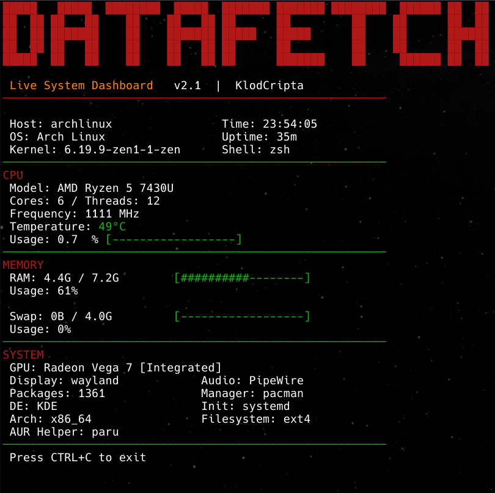

<p align="center">
  
</p>

<h1 align="center">Datafetch – Live System Dashboard</h1>

<p align="center">
A lightweight Bash dashboard showing real-time Linux system information directly in the terminal.
</p>

<p align="center">
  <a href="https://aur.archlinux.org/packages/datafetch">
    
  </a>
  <a href="https://github.com/KlodCripta/Datafetch/blob/main/LICENSE">
    
  </a>
  
</p>

---

Datafetch is a lightweight Bash script that displays real-time information about your Linux system directly in the terminal.

It provides a clean dashboard showing CPU usage, RAM, swap and system details with visual usage bars that update continuously.

Designed to be fast, dependency-light and compatible with most GNU/Linux distributions.
---

## Features

- Live updating system dashboard
- CPU usage with visual bar
- CPU frequency and temperature
- RAM and Swap monitoring with dynamic units
- Hardware and system information overview
- Minimal dependencies
- Works on most Linux distributions

---

## Screenshot

<p align="center">
  
</p>

---

## Dependencies

Datafetch relies only on standard Linux utilities:

- bash
- lscpu
- lspci
- free
- awk
- grep

These are already present on almost all Linux systems.

---

## Installation

### Clone the repository

```bash
git clone https://github.com/KlodCripta/Datafetch.git
cd Datafetch
chmod +x datafetch.sh
./datafetch.sh
```

## Run the script directly
```bash
chmod +x datafetch.sh
./datafetch.sh
```
## Supported Systems

Datafetch is designed to work on most GNU/Linux distributions, including:

- Arch Linux
- EndeavourOS
- Debian / Ubuntu
- Fedora
- openSUSE

## License

This project is released under the MIT License.
