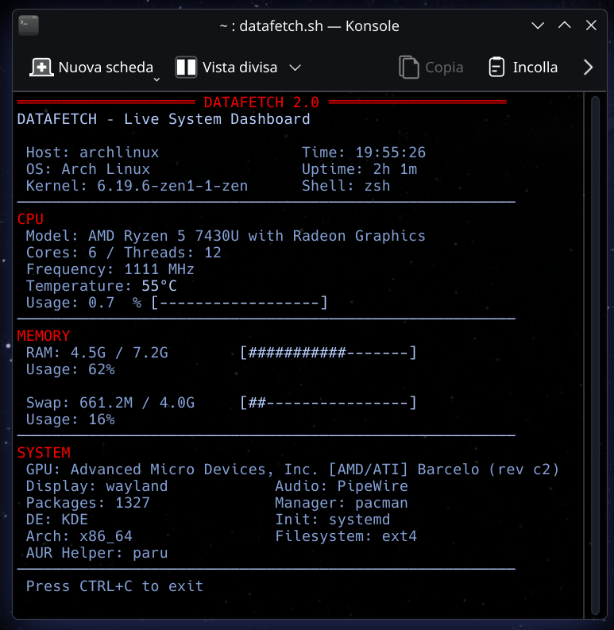

# DATAFETCH – Live System Dashboard

Datafetch is a lightweight Bash script that displays real-time information about your Linux system directly in the terminal.

It provides a clean and constantly updating dashboard showing CPU, memory and system information with visual usage bars.

Designed to be fast, dependency-light and compatible with most GNU/Linux distributions.

---

## Features

- Live updating system dashboard
- CPU usage with visual bar
- CPU frequency and temperature
- RAM and Swap monitoring with dynamic units
- Hardware and system information overview
- Minimal dependencies
- Works on most Linux distributions

---

## Screenshot

<p align="center">
  
</p>

---

## Dependencies

Datafetch relies only on standard Linux utilities:

- bash
- lscpu
- lspci
- free
- awk
- grep

These are already present on almost all Linux systems.

---

## Installation

### Clone the repository

```bash
git clone https://github.com/KlodCripta/Datafetch.git
cd Datafetch
chmod +x datafetch.sh
./datafetch.sh
```

## Run the script directly
```bash
chmod +x datafetch.sh
./datafetch.sh
```
## Supported Systems

Datafetch is designed to work on most GNU/Linux distributions, including:

- Arch Linux
- EndeavourOS
- Debian / Ubuntu
- Fedora
- openSUSE

## License

This project is released under the MIT License.
